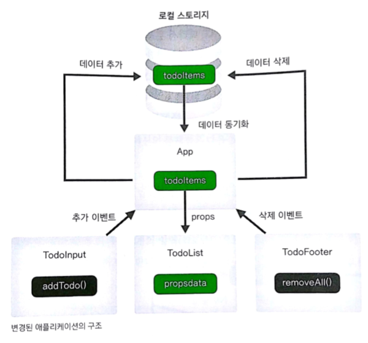

# vue_todo

Vue.js로 할 일 관리 앱(ToDoApp)을 만들기


## 구현 단계

### 1. 프로젝트 생성하고 구조 확인하기

a. 뷰 CLI를 이용한 프로젝트 생성 

b. 프로젝트 초기 설정 

- 반응형 웹 디자인 태그 설정 
- 아이콘 CSS 설정 
- 폰트와 파비콘 설정 

### 2. 컴포넌트 생성하고 등록하기

a. 컴포넌트 생성

- 4개의 하위 컴포넌트 (TodoHeader, TodoInput, TodoList, TodoFooter)

b. 컴포넌트 등록

- 최상의 컴포넌트 App.vue에 하위 컴포넌트를 등록
- 싱글 파일 컴포넌트 체계에서는 import로 다른 위치에 있는 컴포넌트의 내용을 불러온다.

### 3. 컴포넌트 내용 구현하기

a. TodoHeader

- 애플리케이션 제목을 보여주는 컴포넌트
- CSS로 제목 꾸미기

b. TodoInput

- 할 일을 입력하는 컴포넌트
- 인풋 박스 추가하기
  - 인풋 박스에 텍스트를 입력했을 때 뷰 인스턴스에서 텍스트 값을 인식할 수 있게 만듦 (v-model 디렉티브)
- 버튼 추가하기
  - 버튼 클릭 시 특정 동작, 즉 입력한 텍스트 값을 로컬 스토리지에 저장하도록 만듦 (v-on:click 디렉티브)
  - 입력한 텍스트 값을 로컬 스토리지에 저장하는 메서드를 만들 때, 입력한 텍스트가 없을 경우의 예외 처리 코드 넣기
  - 아이콘을 이용해 직관적인 버튼 모양 만들기

c. TodoList

- 저장한 할 일 목록을 보여주는 컴포넌트
- 할 일 목록 만들기
  - 로컬 스토리지 데이터를 뷰 데이터에 저장하기 (인스턴스 라이프 사이클 중 created() 라이프 사이클 훅에 저장 로직을 추가. 뷰의 인스턴스가 생성되자마자 뷰 데이터에 접근 가능한 사이클 훅이다.)
  - 뷰 데이터의 아이템 개수만큼 화면에 표시하기 (v-for 디렉티브)
- 할 일 삭제 기능 추가하기
  - 할 일 목록 & 삭제 버튼 마크업 작업하기
  - 할 일 삭제 버튼에 클릭 이벤트 추가하기 (@click = v-on:click 디렉티브와 동일하게 동작)
  - 선택한 할 일을 뷰에서 인식하도록 만들기
  - 선택한 할 일을 로컬 스토리지와 뷰 데이터에서 삭제하기

d. TodoFooter

- 등록된 모든 할 일을 삭제하는 버튼이 들어가는 컴포넌트
- 모두 삭제하기 버튼 추가하기

### 4. 기존 애플리케이션 구조의 문제점 해결하기

a. 기존 애플리케이션 구조의 문제점

- 할 일을 입력했을 때 할 일 목록에 바로 반영되지 않는 점
- 할 일을 개별 삭제했을 때 할 일 목록에 바로 반영되지 않는 점
- 할 일을 모두 삭제했을 때 할 일 목록에 바로 반영되지 않는 점

b. 문제 해결을 위한 애플리케이션 구조 개선



- 상위 컴포넌트 App에서 데이터 CRUD를 한다.
- 하위 컴포넌트들은 그 데이터를 표현하거나 데이터 조작에 대한 요청 - 이벤트 발생만 한다.

c. props와 이벤트 전달을 이용해 할 일 입력 기능 개선하기

- 상위 컴포넌트 App에서 하위 컴포넌트 TodoList로 데이터 속성을 전달한다. (props)
- 하위 컴포넌트 TodoInput에서 할 일 추가 버튼을 클릭했을 때 상위 컴포넌트 App으로 이벤트를 전달할 수 있게 v-on 디렉티브를 상위 컴포넌트 App에 추가한다.
- TodoInput 컴포넌트와 TodoList 컴포넌트 수정하기
  - App 컴포넌트로 이벤트를 전달할 때 ```this.$emit('addTodo', value)```
  - App 컴포넌트에서 데이터를 받을 때 ```props```
- TodoList에서 불필요한 코드 제거하기
  - 할 일 데이터는 모두 App.vue 파일에서 관리하므로, 데이터 관련 코드 삭제

d. 이벤트 전달을 이용해 '전체 삭제' 버튼 기능 개선하기

- 버튼을 눌렀을 때 자동으로 화면이 갱신되도록 만든다.
- 하위 컴포넌트인 TodoFooter에서 이벤트를 발생시키고, 상위 컴포넌트 App에서 받아 실행시킨다.
  - 상위 컴포넌트 ```v-on:하위 컴포넌트 이벤트 이름="상위 컴포넌트 메서드 이름"``` & 메서드 구현
  - 하위 컴포넌트 ```this.$emit('하위 컴포넌트 이벤트 이름')``` < 버튼 클릭 이벤트 메서드를 수정

e. 이벤트 전달을 이용해 할 일 삭제 기능 개선하기

- 휴지통 아이콘을 눌렀을 때 자동으로 화면이 갱신되도록 만든다.
- 하위 컴포넌트인 TodoList에서 이벤트를 발생시키고, 상위 컴포넌트 App에서 받아 실행시킨다.
  - 상위 컴포넌트 ```@하위 컴포넌트 이벤트 이름="상위 컴포넌트 메서드 이름"``` 혹은 ```v-on:하위 컴포넌트 이벤트 이름="상위 컴포넌트 메서드 이름"``` & 메서드 구현
  - 하위 컴포넌트 ```this.$emit('하위 컴포넌트 이벤트 이름', 인자1, 인자2)```

### 5. 더 나은 사용자 경험을 위한 기능 추가하기

a. 뷰 애니메이션

- 할 일 목록에 할 일을 추가하거나 삭제 시 애니메이션을 추가
- <transition-group>: 목록에 애니메이션을 추가할 때 사용하는 태그
  - tag 속성: 애니메이션이 들어갈 HTML 태그 이름을 지정
  - name 속성: css 클래스 추가 시 사용

b. 뷰 모달(=팝업 대화상자)

- Modal.vue 파일을 만들어 TodoInput.vue의 하위 컴포넌트로 적용

